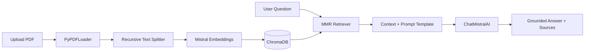

<div align="center">


<a href="https://git.io/typing-svg">
  
</a>

<br/>

<p>
  
  
  
  
  
  
</p>

</div>

<br/>

## 📌 Overview

**DocuChat AI** is a Retrieval-Augmented Generation (RAG) chatbot that lets you upload any PDF — a textbook, research paper, or manual — and ask questions answered strictly from its content. It combines Mistral's embedding and chat models with a local ChromaDB vector store, wrapped in a polished Streamlit interface with live-tunable retrieval settings and full source-chunk transparency.

> Built to demonstrate a complete, production-style RAG pipeline: document ingestion, chunking, vector embedding, MMR-based retrieval, and grounded generation — with no external database or vendor lock-in beyond the Mistral API.

<br/>

## ✨ Features

<table>
<tr>
<td width="50%" valign="top">

### 📄 Document Ingestion
- Upload any PDF directly from the browser
- Automatic chunking with configurable size/overlap
- Per-document vector store (hash-based caching)
- Re-uploads skip re-embedding automatically

</td>
<td width="50%" valign="top">

### 🧠 Retrieval-Augmented Generation
- Mistral `mistral-embed` for semantic embeddings
- MMR search for diverse, non-redundant context
- Strict "context-only" answering — no hallucinated facts
- Configurable top-k, fetch-k, and diversity (λ)

</td>
</tr>
<tr>
<td width="50%" valign="top">

### 💬 Chat Experience
- Persistent multi-turn conversation history
- Source chunks + page numbers shown per answer
- Model + temperature selection on the fly
- One-click chat reset or document swap

</td>
<td width="50%" valign="top">

### 🎨 Interface
- Custom dark, glassmorphism-inspired theme
- Real-time chunk/message metrics
- Responsive layout, no default Streamlit look
- Clean upload-first onboarding flow

</td>
</tr>
</table>

<br/>

## 🧱 System Architecture



<br/>

## 🛠️ Tech Stack

<p>
  
  
  
  
  
  
</p>

**Core techniques applied:** Document chunking · Vector embeddings · Maximal Marginal Relevance (MMR) retrieval · Prompt engineering · Context-grounded generation

<br/>

## 📁 Project Structure

```
DocuChat-AI/
├── app.py               # Streamlit application (upload + chat UI)
├── chroma_stores/        # Auto-generated per-document vector stores
├── requirements.txt
└── README.md
```

<br/>

## 🔧 Installation

```bash
git clone https://github.com/SalikAhmad702/DocuChat-AI.git
cd DocuChat-AI

python -m venv venv

# Windows
venv\Scripts\activate
# macOS/Linux
source venv/bin/activate

pip install -r requirements.txt
```

Create a `.env` file with your Mistral API key:
```
MISTRAL_API_KEY=your_api_key_here
```

Then run the app:
```bash
streamlit run app.py
```

<br/>

## 📖 Usage

| Action | Steps |
|---|---|
| **Upload a document** | Home screen → choose a PDF → click Process document |
| **Ask a question** | Type in the chat box once the document is indexed |
| **View sources** | Expand "Sources" under any answer to see the retrieved chunks + page numbers |
| **Tune retrieval** | Sidebar → adjust chunk size, top-k, fetch-k, or MMR diversity |
| **Switch model** | Sidebar → Model → pick a Mistral model + temperature |
| **Start over** | Sidebar → Load a different document |

<br/>

## 📊 Core Components

| Component | Responsibility |
|---|---|
| `build_vectorstore` | Loads PDF, splits into chunks, embeds via Mistral, persists to ChromaDB |
| `get_retriever` | Configures MMR-based retriever with tunable k / fetch_k / λ |
| `answer_question` | Retrieves context, fills prompt template, queries `ChatMistralAI` |
| `file_hash` | Deduplicates uploads so identical PDFs reuse existing embeddings |

**System prompt used for generation**
```
You are a helpful assistant. Use only the provided context to answer 
the question. If the context does not contain the answer, respond 
with "I don't know."
```

<br/>

## 🗺️ Roadmap

- [x] PDF upload + chunking + embedding pipeline
- [x] MMR retrieval with tunable parameters
- [x] Source-chunk transparency in UI
- [ ] Multi-document / multi-PDF sessions
- [ ] Conversation memory across follow-up questions
- [ ] Support for DOCX and TXT uploads
- [ ] Streaming token-by-token responses
- [ ] Deployment guide (Streamlit Cloud / Docker)

<br/>

## 🤝 Contributing

Contributions are welcome — especially multi-document support, streaming responses, and evaluation metrics for retrieval quality.

```bash
git checkout -b feature/your-improvement
git commit -m "feat: describe your change"
git push origin feature/your-improvement
```
Then open a pull request.

<br/>

## 📄 License

This project is **free and open source** — no license restrictions.

- ✅ Free to use, modify, and distribute
- ✅ Free for personal, academic, and commercial use
- ✅ No attribution required
- ⚠️ Provided "as-is" without warranty

---


## 📧 Let's Connect

<div align="center">

<h3>Built with obsession by <b>Salik Ahmad</b> 🤖</h3>

<p>
  <a href="https://salikahmad.vercel.app/" target="_blank">
    
  </a>
  <a href="https://www.linkedin.com/in/salik-ahmad-programmer/" target="_blank">
    
  </a>
  <a href="https://www.kaggle.com/salikahmad702" target="_blank">
    
  </a>
  <a href="https://github.com/SalikAhmad702" target="_blank">
    
  </a>
</p>

<br/>

<a href="https://salikahmad.vercel.app/">
  
</a>

<br/><br/>


</div>
